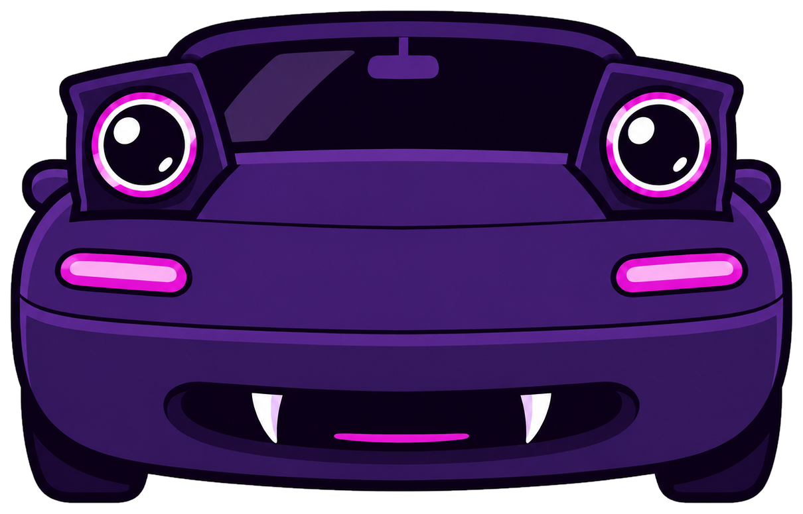
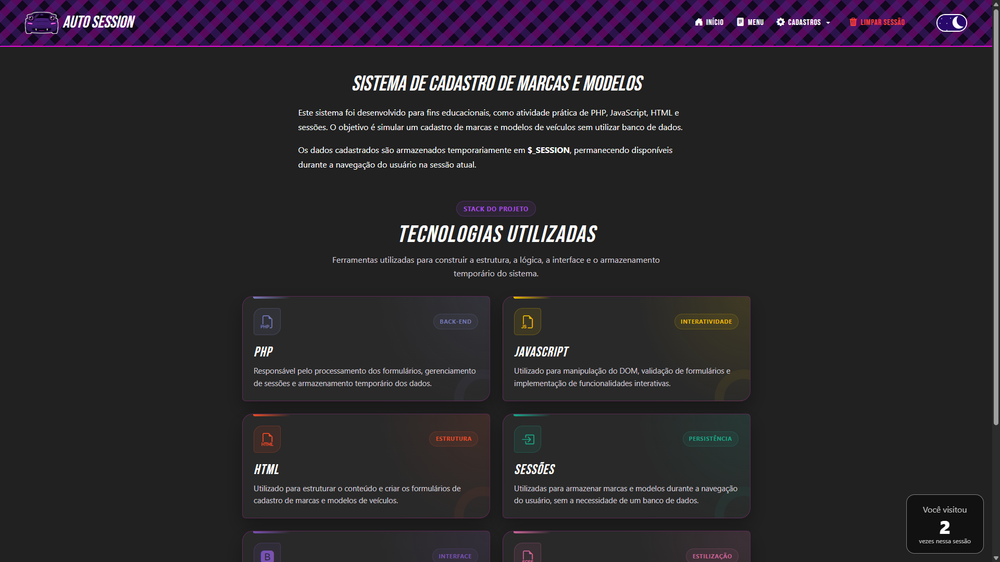

<div align="center">



# Auto Session

**Sistema web para cadastro e manutenção de marcas e modelos de veículos, utilizando sessões PHP como armazenamento temporário.**

[](https://www.php.net/)
[](https://developer.mozilla.org/pt-BR/docs/Web/JavaScript)
[](https://getbootstrap.com/)
[](https://sass-lang.com/)
[](https://www.docker.com/)
[](https://auto-session-php.onrender.com/)

[**Acessar demonstração**](https://auto-session-php.onrender.com/) ·
[**Ver repositório**](https://github.com/gimorais/auto-session-php)

</div>

<p align="center">
  
</p>

## Sobre o projeto

O **Auto Session** é uma aplicação web que permite cadastrar, consultar, editar, excluir e pesquisar marcas e modelos de veículos.

O sistema não utiliza banco de dados. Os registros são armazenados temporariamente em arrays dentro de `$_SESSION`, permitindo praticar persistência durante a navegação, relacionamento entre dados e regras de integridade utilizando PHP.

## Origem do projeto

O projeto começou como uma atividade da disciplina de **Computação II**, desenvolvida a partir de uma sequência de exercícios sobre PHP, JavaScript, HTML e sessões.

Após atender aos requisitos acadêmicos, a aplicação foi ampliada e reorganizada como projeto de portfólio, recebendo melhorias na interface, experiência de uso, responsividade, estrutura dos estilos e processo de publicação.

## Funcionalidades

- Cadastro, listagem, edição e exclusão de marcas;
- Cadastro, listagem, edição e exclusão de modelos;
- Relacionamento de cada modelo com uma marca cadastrada;
- Busca de marcas por descrição;
- Filtro de modelos por marca;
- Validação dos formulários no JavaScript e no PHP;
- Verificação de IDs e descrições duplicadas;
- Regra de integridade que impede excluir marcas com modelos vinculados;
- Modais de confirmação antes da exclusão de registros;
- Mensagens de sucesso, erro, alerta e ausência de resultados;
- Tema claro e escuro;
- Layout responsivo para computadores, tablets e celulares;
- Tabelas com rolagem horizontal em telas menores;
- Contador de acessos durante a sessão;
- Botão de retorno ao topo;
- Opção para limpar os dados armazenados na sessão.

## Além dos requisitos acadêmicos

Durante a evolução do projeto, foram adicionados recursos que não faziam parte da versão inicial da atividade:

- Identidade visual própria;
- Logo e ilustrações personalizadas;
- Interface responsiva com Bootstrap e SCSS;
- Tema claro e escuro com preferência armazenada no navegador;
- Componentes reutilizados por meio de arquivos `include`;
- Modais personalizados para confirmação de exclusão;
- Organização do SCSS por base, componentes e páginas;
- Validações no cliente e no servidor;
- Tratamento de relacionamento e integridade entre marcas e modelos;
- Containerização com Docker;
- Deploy contínuo no Render.

## Tecnologias utilizadas

| Área | Tecnologias | Aplicação no projeto |
| --- | --- | --- |
| Back-end | PHP 8+ | Processamento dos formulários, regras de negócio e gerenciamento das sessões |
| Armazenamento | `$_SESSION` | Persistência temporária de marcas, modelos e contador de acessos |
| Estrutura | HTML5 | Formulários, tabelas e organização semântica das páginas |
| Interatividade | JavaScript | Validações, filtros, tema, modais e botão de retorno ao topo |
| Interface | Bootstrap 5 e Bootstrap Icons | Grid responsivo, componentes, utilitários e ícones |
| Estilização | SCSS / Sass | Variáveis, módulos, componentes e geração do CSS |
| Infraestrutura | Docker e Render | Padronização do ambiente e publicação da aplicação |
| Versionamento | Git e GitHub | Histórico de alterações e disponibilização do código |

## Como o sistema funciona

As marcas e os modelos são armazenados em dois arrays dentro da sessão:

```php
$_SESSION["marcas"] = [];
$_SESSION["modelos"] = [];
```

Cada modelo possui o identificador da marca à qual está relacionado:

```php
[
    "id" => 1,
    "description" => "MX-5",
    "idmarca" => 1
]
```

Ao listar os modelos, o PHP procura a marca correspondente para exibir sua descrição. Antes de excluir uma marca, o sistema verifica se existem modelos vinculados e bloqueia a operação quando necessário.

## Aprendizados

O desenvolvimento do Auto Session permitiu praticar:

- Gerenciamento de sessões em PHP;
- Manipulação de arrays associativos;
- Operações de cadastro, consulta, edição e exclusão;
- Relacionamento lógico entre estruturas de dados;
- Regras de integridade entre registros;
- Validação de dados no cliente e no servidor;
- Manipulação do DOM com JavaScript;
- Criação de filtros e buscas;
- Componentização básica com `include` e `require_once`;
- Organização de estilos com SCSS;
- Desenvolvimento de interfaces responsivas;
- Uso de Git e GitHub;
- Containerização e deploy de aplicações PHP.

## Executar localmente

### Pré-requisitos

Para executar a aplicação diretamente, é necessário ter o **PHP 8 ou superior** instalado.

O Node.js é necessário somente para recompilar os arquivos SCSS.

### Clonar o repositório

```bash
git clone https://github.com/gimorais/auto-session-php.git
cd auto-session-php
```

### Iniciar o servidor PHP

```bash
php -S localhost:8000
```

Acesse no navegador:

```text
http://localhost:8000
```

## Trabalhar com o SCSS

Instale as dependências:

```bash
npm install
```

Recompile o CSS automaticamente durante o desenvolvimento:

```bash
npm run sass
```

Gere o arquivo CSS final e minificado:

```bash
npm run build:css
```

## Executar com Docker

Crie a imagem:

```bash
docker build -t auto-session-php .
```

Inicie o container:

```bash
docker run --rm -p 10000:10000 auto-session-php
```

Acesse:

```text
http://localhost:10000
```

## Deploy

A aplicação está publicada no Render:

**https://auto-session-php.onrender.com/**

O repositório contém os arquivos `Dockerfile`, `render.yaml` e `health.php`, utilizados na configuração e na verificação do serviço.

> Como o projeto utiliza sessões e não possui banco de dados, os registros são temporários. Eles podem ser removidos ao encerrar a sessão, ao utilizar a opção de limpeza ou quando o serviço de hospedagem for reiniciado.

## Estrutura principal

```text
auto-session-php/
├── assets/
│   ├── css/
│   ├── img/
│   ├── js/
│   └── scss/
├── includes/
│   ├── footer.php
│   ├── header.php
│   ├── scroll-top.php
│   └── viewcount.php
├── Dockerfile
├── health.php
├── index.php
├── limparSessao.php
├── manterMarca.php
├── manterModelo.php
├── menu.php
├── package.json
├── render.yaml
└── README.md
```

## Limitações atuais

Por utilizar `$_SESSION` como armazenamento:

- Os dados não são permanentes;
- Os registros não são compartilhados entre usuários;
- Não há autenticação;
- Não existe integração com banco de dados.

Essas características são intencionais, pois o objetivo do projeto é demonstrar o uso de sessões PHP e o relacionamento entre dados em uma aplicação acadêmica.

## Autoria

Desenvolvido por **Giovana Silva Morais**.

[GitHub](https://github.com/gimorais) ·
[LinkedIn](https://www.linkedin.com/in/gimorais/)

## Licença

Este projeto está disponibilizado para fins de estudo, demonstração e portfólio.

**© 2026 Giovana Silva Morais. Todos os direitos reservados.**
